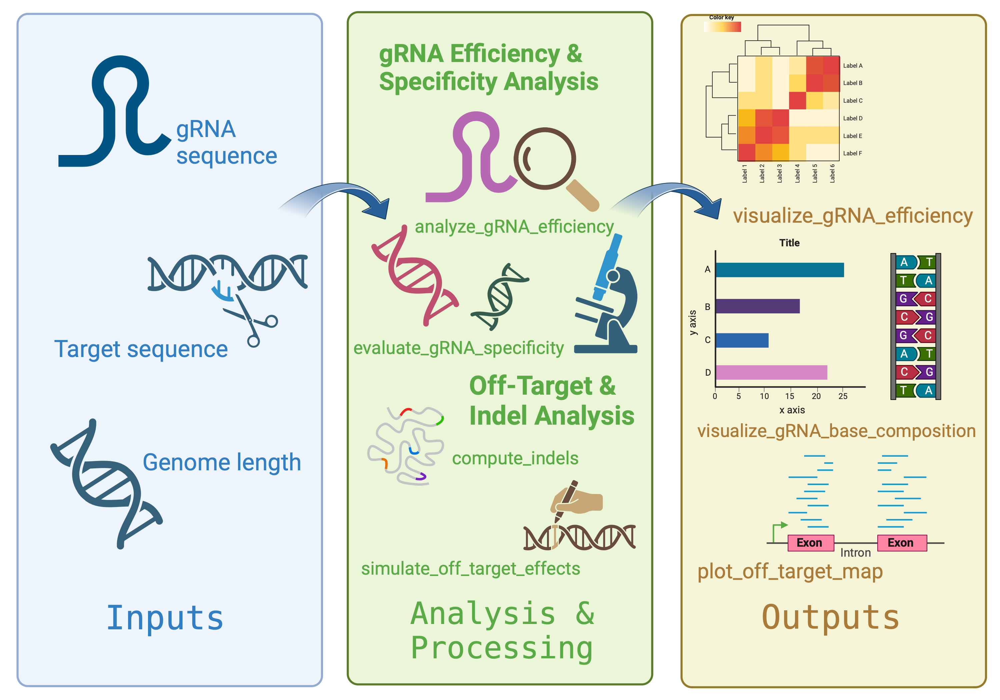

<!-- README.md is generated from README.Rmd. Please edit that file -->

```{r, include = FALSE}
knitr::opts_chunk$set(
  collapse = TRUE,
  comment = "#>",
  fig.path = "man/figures/README-",
  out.width = "100%"
)
```

# CRISPRAid

<!-- badges: start -->
<!-- badges: end -->

CRISPRAid is an R package designed to facilitate comprehensive analysis of CRISPR-Cas9 guide RNA (gRNA) data, enabling researchers to evaluate gRNA efficiency, assess off-target risks, analyze sequence composition, and visualize results. CRISPRAid includes tools for simulating off-target effects, computing mutation-induced insertions and deletions (indels), and generating informative plots to support data interpretation and decision-making in CRISPR experiments.

The package was developed using R version 4.3.1 and has been optimized to work efficiently on this platform.

## Installation

You can install the development version of CRISPRAid from [GitHub](https://github.com/) with:

``` r
# install.packages("pak")
pak::pak("cymnyon/CRISPRAid")
```

## Overview

CRISPRAid includes the following functions:

- **analyze_gRNA_efficiency**: Computes the efficiency of gRNA sequences, helping determine their suitability for targeting.
- **evaluate_gRNA_specificity**: Assesses gRNA specificity against target sequences to reduce off-target effects.
- **compute_indels**: Calculates the frequency of indels in sequencing data, aiding in mutation rate analysis.
- **simulate_off_target_effects**: Simulates potential off-target binding across a genome, providing a risk profile for each gRNA.
- **visualize_gRNA_efficiency**: Generates a heatmap of gRNA efficiencies for visual comparison.
- **visualize_gRNA_base_composition**: Creates a bar plot to display nucleotide composition (A, T, G, C) of gRNA sequences.
- **plot_off_target_map**: Maps predicted off-target sites across a genome, offering insights into binding distribution.

### Workflow Diagram



## Example Usage

Here’s a basic example demonstrating CRISPRAid’s functionality. Load the package and use some of the core functions:

```{r}
# Load CRISPRAid in development mode
if (requireNamespace("devtools", quietly = TRUE)) {
  devtools::load_all(".")
} else {
  message("Please install the 'devtools' package to load CRISPRAid in development mode.")
}

# Example of computing gRNA efficiency
efficiency_result <- analyze_gRNA_efficiency("GACGTCTAGT", "TGCTACGTAG")

# Example of visualizing base composition
gRNA_seqs <- c("GACGTCTAGT", "TGCATCTAGG", "GACGTGTAGT")
visualize_gRNA_base_composition(gRNA_seqs)
```

## Contributions

CRISPRAid was developed by Soomi Choi with the following contributions:

- **analyze_gRNA_efficiency**: Authored by Soomi Choi using R’s built-in error handling and control structures to ensure efficient gRNA performance analysis.
- **evaluate_gRNA_specificity**: Developed to quantify gRNA accuracy by reducing off-target effects; inspiration was drawn from off-target analysis techniques in CRISPR research.
- **compute_indels**: Written to calculate indel frequencies, this function validates inputs carefully, based on the author’s original logic.
- **simulate_off_target_effects**: Built to model potential off-target sites using random sampling; Soomi Choi implemented the simulation logic with R’s random number generation functions.
- **Visualization Functions**: Each visualization function was designed by Soomi Choi to ensure that CRISPR data analysis outputs are clear and easily interpretable.

## References

1. Zhu, L.J., Gazin, C., Lawson, N.D., Pagès, H., Lin, S.M., Lapointe, D.S., and Green, M.R. 2014. “CRISPRseek: a Bioconductor package to identify off-targets of guide RNAs generated by CRISPR-Cas9 technology.” *BMC Bioinformatics* 15 (1): 142. [https://bioconductor.org/packages/CRISPRseek/](https://bioconductor.org/packages/CRISPRseek/).

2. Pagès, H., Aboyoun, P., Gentleman, R., and DebRoy, S. 2023. *Biostrings: Efficient manipulation of biological strings.* R package version 2.69.2, Bioconductor. [https://bioconductor.org/packages/Biostrings/](https://bioconductor.org/packages/Biostrings/).

3. Jinek, M., Chylinski, K., Fonfara, I., Hauer, M., Doudna, J.A., and Charpentier, E. 2012. “A programmable dual-RNA–guided DNA endonuclease in adaptive bacterial immunity.” *Science* 337 (6096): 816-821.

4. Hsu, P.D., Lander, E.S., and Zhang, F. 2014. “DNA targeting specificity of RNA-guided Cas9 nucleases.” *Nature Biotechnology* 31 (9): 827-832.

5. Fu, Y., Foden, J.A., Khayter, C., Maeder, M.L., Reyon, D., Joung, J.K., and Sander, J.D. 2013. “High-frequency off-target mutagenesis induced by CRISPR-Cas nucleases in human cells.” *Nature Biotechnology* 31 (9): 822-826.

6. Doench, J.G., Fusi, N., Sullender, M., Hegde, M., Vaimberg, E.W., Donovan, K.F., Smith, I., et al. 2016. “Optimized sgRNA design to maximize activity and minimize off-target effects of CRISPR-Cas9.” *Nature Biotechnology* 34 (2): 184-191.

7. crisprVerse. “crisprBase: An R Package for Comprehensive CRISPR-Cas gRNA Analysis.” 2023. [https://github.com/crisprVerse/crisprBase](https://github.com/crisprVerse/crisprBase).

8. Bioinformatics Core, University of Michigan. “CRISPR-Cas9 Off-Target Prediction Tool.” 2023. [https://github.com/umich-brcf-bioinf/CRISPR-Cas9-Off-Target-Prediction-Tool](https://github.com/umich-brcf-bioinf/CRISPR-Cas9-Off-Target-Prediction-Tool).

9. Zhu, W., Zhong, X., Xu, M., Hu, L., and Zhang, L. 2020. “Analysis and visualization of CRISPR-Cas9 editing outcomes and assessment of potential off-targets with CRISPResso2.” *Nature Protocols* 15 (2): 325-347.

10. Jiang, F., and Doudna, J.A. 2017. “CRISPR–Cas9 Structures and Mechanisms.” *Annual Review of Biophysics* 46: 505-529.

